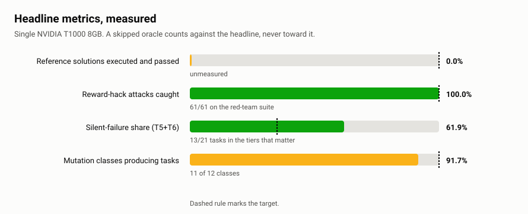
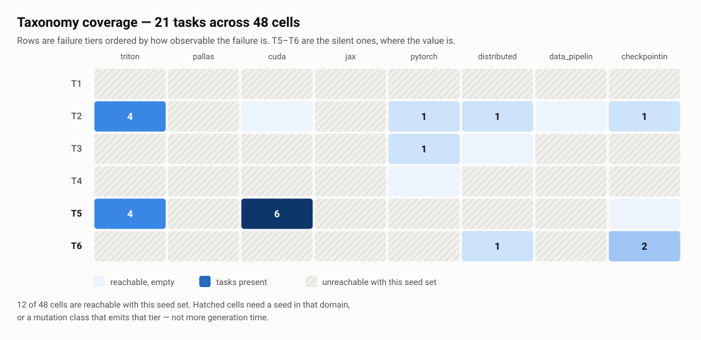
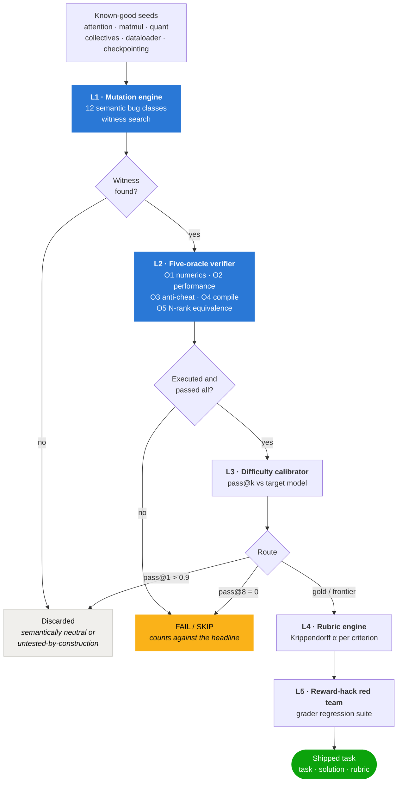

# gpu-kernel-verification-harness

[](https://github.com/ArchanaChetan07/gpu-kernel-verification-harness/actions/workflows/ci.yml)
[](https://www.python.org/downloads/)
[](https://pytorch.org/)
[](LICENSE)

**CRUCIBLE** generates GPU-kernel and distributed-training debugging tasks by mutating
known-good code, then **executes every reference solution on real hardware** through five
independent oracles before the task is allowed to ship.

It exists because of one measurement that is almost never taken:

> **What fraction of shipped reference solutions was ever actually executed?**

In kernel and training-infrastructure work, "correct" is four-dimensional — numerics,
performance, compilation, and distributed semantics — and checking it needs accelerators in
the loop. So the common failure is not a bad task. It is a **plausible-but-wrong reference
solution that was never run**, which is indistinguishable from a correct one in the
deliverable and surfaces months later as model behaviour.

---

## Results

Measured on a single NVIDIA T1000 8GB (sm_75), CPU-only CI on every push. Full run
recorded in [docs/RESULTS.md](docs/RESULTS.md).

| | measured | target |
|---|---|---|
| Reference solutions executed and passed every applicable oracle | **93.3%** (14/15) | 100% |
| Reward-hack attacks caught by the harness | **100%** (61/61) | 100% |
| Silent-failure share of the bank (T5+T6) | **61.9%** | ≥35% |
| Mutation classes producing admitted tasks | **11/12** | — |
| Taxonomy cells reachable with the current seed set | **12/48** | see below |
| Test suite | **~600 passing** | green on every push |

<p align="center">
  <picture>
    <source media="(prefers-color-scheme: dark)" srcset="docs/assets/metrics-dark.svg">
    
  </picture>
</p>

The coverage number is reported unflattered on purpose. Twelve of the 48 cells need JAX/Pallas
seeds that cannot execute on this machine at all, and the T1 row needs a mutation class that
emits a compile error — which needs a working compiler. Quoting a raw fill rate while knowing
the ceiling would be the same unverified claim the project exists to eliminate.

<p align="center">
  <picture>
    <source media="(prefers-color-scheme: dark)" srcset="docs/assets/coverage-dark.svg">
    
  </picture>
</p>

Hatched cells are not gaps the generator can close by running longer — they need a seed in that
domain, or a mutation class that emits that tier. Both charts are regenerated from the bank by
[`scripts/make_charts.py`](scripts/make_charts.py), so they cannot drift from what was measured.

---

## The invariant that shapes everything

**A task ships only if its reference solution was executed and passed every applicable
oracle. `SKIP` is never `PASS`.**

An oracle that cannot run returns a skip carrying its real reason; that task counts *against*
the headline metric, and the run prints exactly which claims went unverified. No oracle
fabricates evidence — if the profiler is absent, the counters are **absent**, not zero.

---

## What is novel here

**Mutation instead of mining.** Tasks mined from public repositories are already in the
pretraining corpus, so a model can recall rather than solve. Applying a semantically
meaningful mutation to known-correct code yields a task whose ground truth is the inverse
diff and which has never existed in any repository.

**Every task carries a witness.** A mutation is admitted only if the engine can produce a
concrete input on which the mutant demonstrably differs from the baseline. No witness means
the mutation is semantically neutral or untested-by-construction, and it is discarded — the
structural guarantee that every shipped task has a real, reachable answer. In practice this
discards a large fraction of candidates, which is the mechanism working.

**Tolerance is derived, never hardcoded.** `1e-3` is a guess, not a tolerance. The numerics
oracle derives one from an error budget — accumulation depth × dtype epsilon × a safety
factor — and prints the derivation alongside every verdict:

```
fp16 eps=4.88e-04, K=129, stochastic growth sqrt(K)=11.36, safety=4 -> rel=2.22e-02
```

**The grader is regression-tested against itself.** A standing suite of deliberate cheats —
calling the fused op the task forbids, memoising inputs, hardcoding a block size, letting
dead-code elimination remove the work, returning the right shape with wrong values fast —
must all be caught before a task template ships. An attack caught by *no* oracle is reported
as a grader defect, not an attack failure.

**Statistics that hold up.** Unbiased `pass@k` (Chen et al.) computed in log space, never
`(c/n)^k`. Krippendorff's α validated against published worked examples. Anytime-valid
confidence sequences (Hoeffding / empirical-Bernstein / betting) so rubric agreement can be
monitored as ratings accumulate without a peeking problem. Bootstrap CIs on every timing
ratio, and a performance regression is admitted only when the interval's **lower** bound
clears the threshold.

---

## Architecture



**The organizing idea.** Every task family is stratified by *how observable the failure is* —
T1 (compile error: the message is the answer) through T6 (silent convergence divergence: the
loss curve looks fine and the model is quietly worse). Coverage is a 6×8 grid of 48 cells.
Frontier models are already strong at T1–T2, where the error text carries the answer. The
value, and the real-world cost, sit at T5–T6.

| tier | failure | signal available | skill required |
|---|---|---|---|
| T1 | compile error | full message and line | read the error |
| T2 | crash | stack trace, sanitizer | localize from a trace |
| T3 | hang / deadlock | nothing until timeout | reason about collective ordering |
| T4 | performance cliff | correct output, wrong speed | read a profile, know the roofline |
| **T5** | **silent numerics** | correct-looking, wrong values | design a differential experiment |
| **T6** | **silent divergence** | loss descends, to the wrong place | multi-rank differential reasoning |

### The five oracles

| | checks | notes |
|---|---|---|
| **O1** numerics | differential test across an adversarial shape sweep | `seq_len ∈ {1,127,128,129,1023,4096}`, empty blocks, non-contiguous strides, fp32/bf16/fp16; reports the shape where it *first* breaks |
| **O2** performance | locked clocks, warmup discarded, ≥30 reps, median + bootstrap CI | roofline denominated by *measured* achievable bandwidth, not a spec sheet |
| **O3** anti-cheat | 5 independent checks | AST denylist with alias resolution, randomized inputs, held-out shapes, output liveness, memory-movement timing floor |
| **O4** compile | graph breaks, Triton register spills, emitted IR diff | each sub-check skips with its own reason |
| **O5** N-rank | 1-rank vs N-rank loss curves over gloo | tolerance calibrated from a *measured* float non-associativity noise floor |

---

## What the harness caught in its own construction

The instrument was pointed at itself throughout. A selection of real defects it surfaced:

**The anti-cheat oracle failed 11 of 15 correct reference solutions.** Its memoisation check
runs a candidate on two freshly seeded inputs and fails it if the output is byte-identical.
It was grading on the cheapest shape, which was `n_ctx=0` — where the *known-correct
reference* returns zeros for every input. The check now selects a shape where the reference
itself demonstrably depends on its input, making it self-checking: it can only fire where a
real dependence exists to be lost.

**Two oracles disagreed about what "correct" means.** O3 used the derived tolerance but
applied it with its own comparison, which flagged layernorm outputs near zero, where a
negligible absolute error is an enormous relative one. O1 passed the same shapes because its
comparison handles near-zero references deliberately. O3 now delegates to that one
implementation — two definitions of correct is one too many.

**An entire tier was undiscoverable by construction.** T4 means *correct output, wrong
speed*, so such a mutation is byte-identical and every correctness-based witness was blind to
it. Added a performance witness that admits on the lower bound of a bootstrap CI.

**A mutation class advertised 37 sites that could never produce a task.** Its transform was
value-preserving by construction. Scoped to the 8 sites with a real aliasing precondition and
documented that the value-changing variant requires a compiler that selects layouts.

**Two mutation classes matched an idiom real code does not use.** Both assumed the in-place
`dist.all_reduce(t)` statement form; the seeds use a functional helper that returns a value,
because they must run single-process to be differentially testable. Exact-name matching found
nothing in precisely the code the mutation existed to attack.

**CI caught a packaging defect on its first run.** `cli.py` imported `click` at module scope
without declaring it — it worked locally only because the development environment happened to
ship it. Any clean `pip install` would have failed.

---

## Quick start

```bash
pip install -e .
crucible doctor
```

`doctor` reports what the current machine can honestly verify, oracle by oracle, and names
what is missing for the ones it cannot.

```bash
crucible mutate --seed all --classes all --limit 50 --out bank/
crucible verify-bank bank/ -o verdicts/
crucible report bank/ verdicts/ -o report.html
```

Or the whole pipeline, with a capability preflight, resume-on-disconnect, and a cost line:

```bash
./scripts/pipeline.sh --smoke     # ~5 min shakeout
./scripts/pipeline.sh             # full run
```

### On rented hardware

See [docs/RUNNING_ON_RENTED_GPU.md](docs/RUNNING_ON_RENTED_GPU.md). Docker, a Modal app, and
a bare-pod bootstrap are included.

```bash
modal run deploy/modal_app.py::doctor    # what can this card verify
modal run deploy/modal_app.py::smoke     # six tasks end to end
```

Most of the harness runs anywhere, including CPU-only. What genuinely needs a Linux GPU box:
O4's Triton lowering and register-spill checks, the T1 tier, and any JAX/Pallas seed.

---

## Layout

| path | what |
|---|---|
| [`crucible/capabilities.py`](crucible/capabilities.py) | probes what this machine can verify; every skip reason traces here |
| [`crucible/taxonomy.py`](crucible/taxonomy.py) | T1–T6 × 8 domains, the 48-cell coverage grid |
| [`crucible/seeds/`](crucible/seeds/) | known-good baselines carrying real mutation sites |
| [`crucible/mutate/`](crucible/mutate/) | 12 mutation classes, witness search, task generation |
| [`crucible/oracles/`](crucible/oracles/) | O1 numerics, O2 performance, O3 anti-cheat, O4 compile, O5 N-rank |
| [`crucible/calibrate/`](crucible/calibrate/) | unbiased pass@k, interval-aware routing, 2PL IRT |
| [`crucible/rubric/`](crucible/rubric/) | Krippendorff α, anytime-valid confidence sequences |
| [`crucible/redteam/`](crucible/redteam/) | attack solutions the grader must catch |
| [`crucible/report/`](crucible/report/) | headline metrics, coverage grid, self-contained HTML |
| [`docs/CONTRACT.md`](docs/CONTRACT.md) | the normative interface contract every module is written against |

---

## Design notes

**Seeds simulate kernel structure in pure PyTorch** — explicit tile loops, explicit
accumulator dtypes, explicit boundary masks, explicit stores. This keeps mutation sites
structurally real while remaining executable on CPU and GPU alike, instead of being blocked
on a toolchain. Each seed's ground truth is an *independent* native op, never the seed
compared against itself.

**O5 calibrates its own tolerance.** Before comparing anything it measures the float
non-associativity noise floor by running the 1-rank configuration twice under different
summation orders, then gates on a multiple of the measured floor rather than an assumed
constant.

**Anti-cheat is AST-based, not string matching.** Alias-resolved imports, dotted attribute
chains, dynamic `getattr`, and `__import__` are all caught. The uninitialised-output check
runs the same call into two differently pre-filled buffers and requires identical results.

The confidence-sequence machinery in `crucible/rubric/sequences.py` is adapted from the
author's `certified-sparse-attention` project.

## License

MIT — see [LICENSE](LICENSE).
